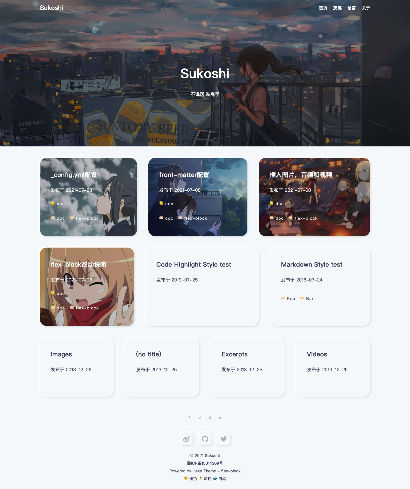
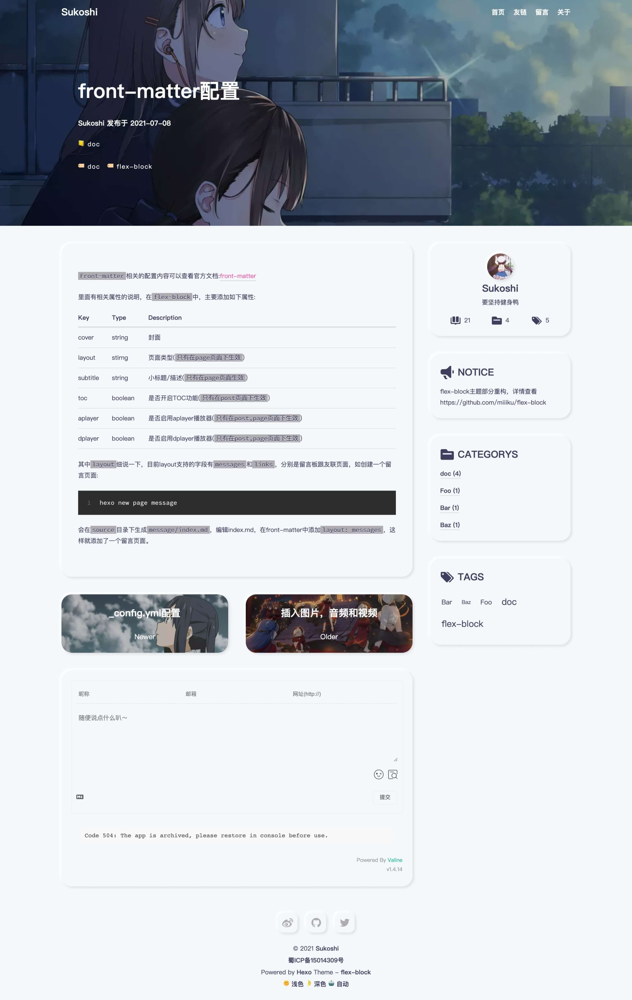

# hexo-theme-flexblock


一个卡片类拟态风格的Hexo主题





### v2.0已发布，重构部分代码。如需要查看v1.0的代码请访问:[v1.0](https://github.com/miiiku/hexo-theme-flexblock/tree/v1.0)

## Example Site

**[DEMO](https://kiyori.xyz)**

## Document

Change description: [flex-block改动说明](https://kyori.xyz/2021/07/080920.html)

doc list: [docs](https://kyori.xyz/categories/doc/)

- [_config.yml配置](https://kyori.xyz/2021/07/081144.html)

- [front-matter配置](https://kyori.xyz/2021/07/081100.html)

- [插入图片，音频和视频](https://kyori.xyz/2021/07/081010.html)

### 安装主题

#### 通过 GIT 安装

从 GitHub 下载主题并将其添加到你的 Hexo 项目目录的 `themes` 目录下

```shell
# 通过 git clone 命令将主题下载到 theme 目录
git clone https://github.com/miiiku/hexo-theme-flexblock.git ./themes/flexblock
```

> 如果你不是 `git` 用户，也可以从[https://github.com/miiiku/hexo-theme-flexblock/archive/refs/heads/master.zip](https://github.com/miiiku/hexo-theme-flexblock/archive/refs/heads/master.zip)下载主题的压缩包，然后解压到你的 Hexo 项目目录的 `theme` 目录下，并重命名 `hexo-theme-flexblock-master` 为 `flexblock` 。

进入 `./themes/flexblock` 编辑 `_config.yml` 以配置你的站点信息

#### 通过 NPM 安装

> 此方法只支持 Hexo 5.0.0 以上版本

```shell
# 通过 npm 将主题的 package 安装到你的 Hexo 项目中
npm install hexo-theme-flexblock
# # 如果使用 yarn，则执行以下命令
# yarn add hexo-theme-flexblock
```

在你的 Hexo 项目目录下新建 `_config.flexblock.yml`，然后把 [主题配置文件的内容](https://github.com/miiiku/hexo-theme-flexblock/blob/master/_config.yml) 粘贴到文件里面，再配置你的站点信息

### 应用主题

编辑你的 Hexo 项目目录下的 `_config.yml` 文件，找到**theme**并设置值为 `flexblock`
